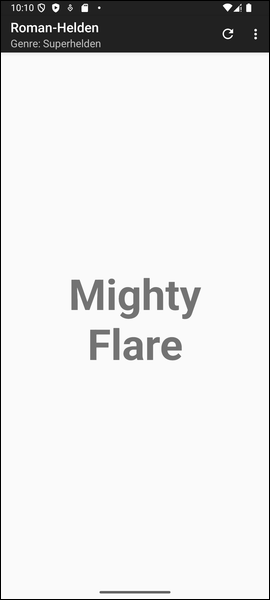

# Android-App "Roman-Helden": Namensgenerator für Schriftsteller #

 

Dieses Repo enthält ein Android-Studio-Projekt für eine native Android-App mit Java.
Die App ist ein einfacher Generator für Namen von Romanfiguren, wobei verschiedene
Literaturgenres (z.B. Science Fiction oder Kinderbücher) ausgewählt werden können.

Die App demonstriert die Verwendung eines `PreferenceScreen`, siehe auch 
[diese Seite](https://developer.android.com/develop/ui/views/components/settings?hl=de#java) 
in der offiziellen Android-Doku.

 

----

## Screenshots ##

 

 &nbsp; 

 

----

## License ##

 

See the [LICENSE file](LICENSE.md) for license rights and limitations (BSD 3-Clause License).

 
