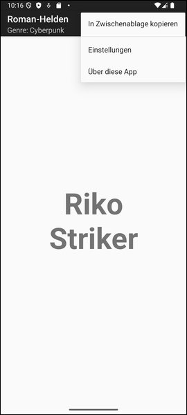

# Android-App "Roman-Helden": Namensgenerator für Schriftsteller #

<br>

Dieses Repo enthält ein Android-Studio-Projekt für eine native Android-App mit Java.
Die App ist ein einfacher Generator für Namen von Romanfiguren, wobei verschiedene
Literaturgenres (z.B. Science Fiction oder Kinderbücher) ausgewählt werden können.

Die App demonstriert die Verwendung eines `PreferenceScreen`, siehe auch 
[diese Seite](https://developer.android.com/develop/ui/views/components/settings?hl=de#java) 
in der offiziellen Android-Doku.

<br>

----

## Screenshots ##

<br>

 &nbsp; 


<br>

----

## Beispiel für Datei mit Shared Preferences ##

<br>

Die Einstellungen werden in einer Datei mit Namen `de.eldecker.droid.romanhelden_preferences.xml` im Ordner `/data/data/de.eldecker.droid.romanhelden` gespeichert (`de.eldecker.droid.romanhelden` ist die Package-ID dieser App, siehe Wert von Attribut `android.defaultConfig.applicationId` in Datei `app/build.gradle`).

Beispiel für den Inhalt dieser Datei:
```
<?xml version='1.0' encoding='utf-8' standalone='yes' ?>
<map>
    <int name="schriftgroesse_name" value="67" />
    <string name="literatur_genre">KINDERBUCH</string>
    <boolean name="alles_grossbuchstaben" value="false" />
    <boolean name="animation_aktiv" value="false" />
    <int name="namen_zaehler" value="41" />
</map>
```

----

## License ##

<br>

See the [LICENSE file](LICENSE.md) for license rights and limitations (BSD 3-Clause License).

<br>
